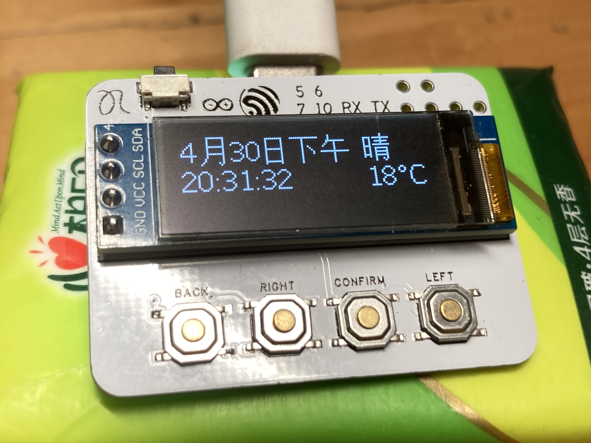
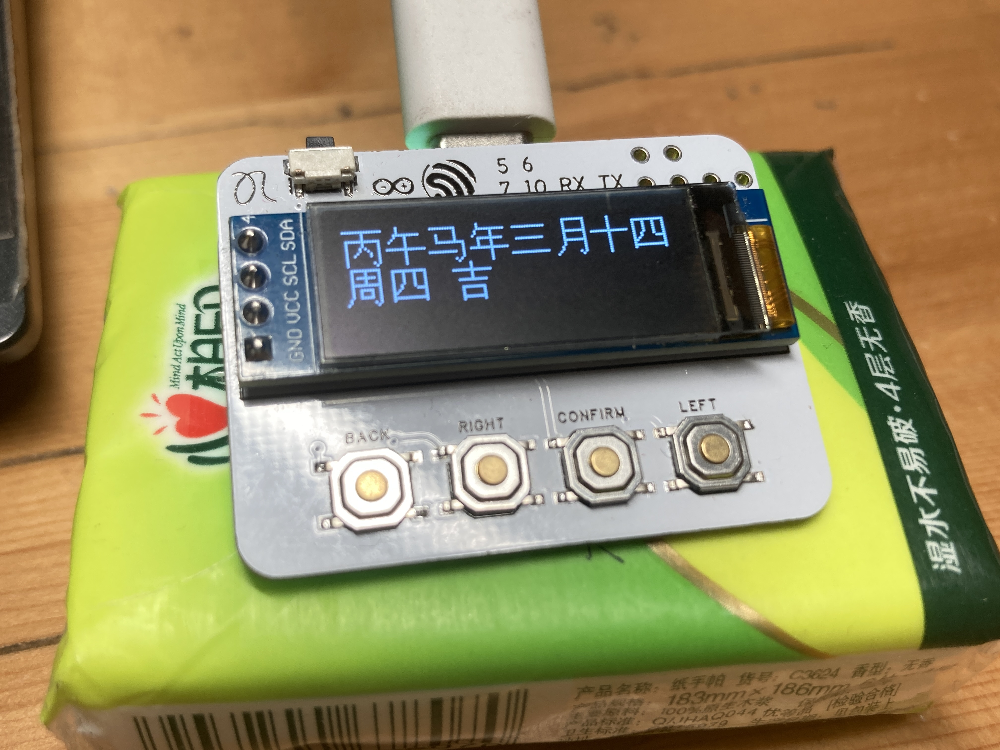

# 🛰️ 代号“夜鹭”小时钟


## ✨ 特点
- 🕒 **NTP时间同步**: 开机时自动从苹果服务器获取时间
- 🌤️ **天气功能**: 开机时从心知天气获取数据
- 🌊 **灵动UI**: 界面之间切换如德芙般丝滑
- 🌙 **自动省电**: 可设置秒钟后息屏，自动断网机制

## 🛠️ 硬件总览
- **处理器**: ESP32-C3
- **屏幕**: SSD1306 128x32 OLED
- **按钮**: 5个 (Confirm, Left, Right, Back, Sleep)

## 🚀 开始个性化
1. Clone this repo to your PlatformIO environment.
2. Edit `include/conf.h` to add your WiFi credentials:
   ```cpp
   #define WIFI_SSID "Your_SSID"
   #define WIFI_PASS "Your_Password"

## 📷 Pictures

### 🕒 Main Interface
The clock interface features a clean layout with time, date, and real-time weather.
<p align="center">
  
</p>

### 📱 Smooth Menu System
Fluid easing animations for seamless navigation between settings and apps.
<p align="center">
  
</p>

---
> this program Gemini wrote it.

> 我的[哔哩哔哩账号](https://space.bilibili.com/2121656213) 附带演示和使用说明。

> 在干燥适宜温度环境下使用，仅进行正常操作（静置、携带、充电、烧录官方程序）。对于非正常使用造成的任何损害，本人(即项目作者)不承担责任。
