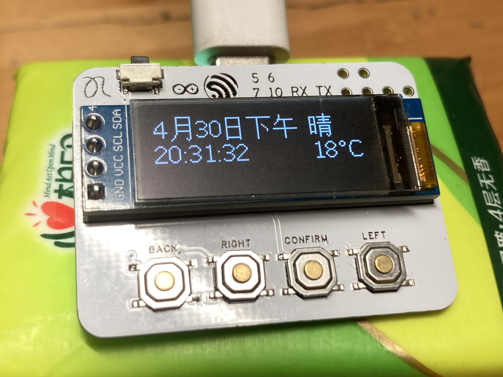
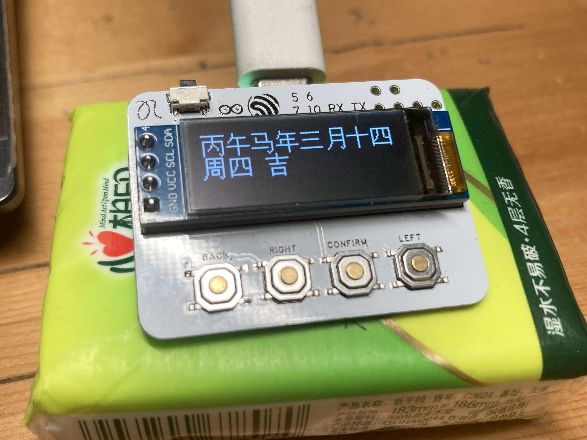

# 🛰️ Heron Clock (夜鹭时钟)


An elegant, smooth-animation ESP32-C3 desk clock featuring real-time weather, NTP time synchronization, and a custom UI engine.


## ✨ Features
- 🕒 **NTP Sync**: Auto-syncing time with millisecond precision via Apple Time servers.
- 🌤️ **Live Weather**: Real-time weather data fetched from Seniverse API.
- 🌊 **Fluid UI**: Smooth easing animations for menu transitions and page switching.
- 🛠️ **System Monitor**: Built-in status page to monitor IP address and ESP32 core temperature.
- 🌙 **Power Saving**: Customizable auto-sleep mode and manual brightness control.

## 🛠️ Hardware Requirements
- **Core**: ESP32-C3 DevKit
- **Display**: SSD1306 128x32 OLED (I2C)
- **Buttons**: 5-button navigation (Confirm, Left, Right, Back, Sleep)

## 🚀 Quick Start
1. Clone this repo to your PlatformIO environment.
2. Edit `include/conf.h` to add your WiFi credentials:
   ```cpp
   #define WIFI_SSID "Your_SSID"
   #define WIFI_PASS "Your_Password"

## 📷 Pictures

### 🕒 Main Interface
The clock interface features a clean layout with time, date, and real-time weather.
<p align="center">
  
</p>

### 📱 Smooth Menu System
Fluid easing animations for seamless navigation between settings and apps.
<p align="center">
  
</p>

---
> **Tip:** To get the best results, use a tripod when photographing your OLED screen to avoid blur!
